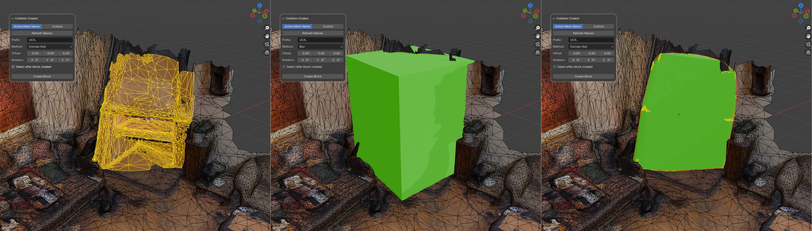
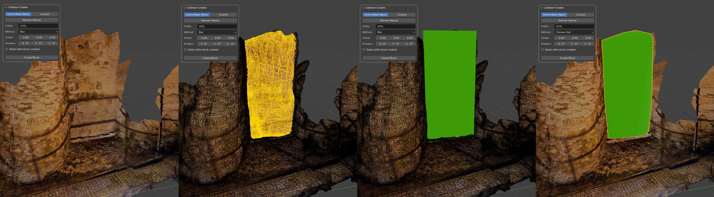
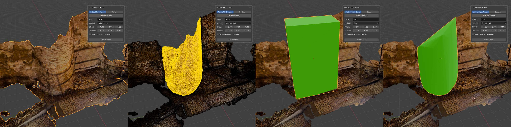
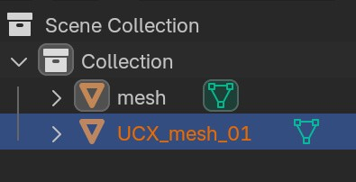

# Collision Creator Blender Addon

The **Collision Creator** addon for Blender allows you to quickly create collision **blocks** or **convex hulls** based on a selected area in the active mesh. It is particularly useful for generating collision geometry for exporting to game engines such as [Unreal Engine](https://www.unrealengine.com/en-US?sessionInvalidated=true) (UCX_), [Unity](https://unity.com/), [Source Engine](https://developer.valvesoftware.com/wiki/Source) and other.

## Features

- Create simple **Box** or **Convex Hull** collision blocks.
- **Automatically** adjust block **names** using the active object's name or a custom name:  

- Easily offset and rotate created collision blocks.
- Option to automatically select the created collision block after creation.

## Installation

1. [Download the addon](https://github.com/zmnv/blender-collision-creator/releases/download/1.0.2/collision_creator_1.0.2.zip) as a `.zip` file.
2. In Blender, go to `Edit > Preferences > Add-ons` and click `Install`.
3. Select the downloaded `.zip` file and enable the addon.

## How to Use

1. **Select an Area**:
   - In `Edit Mode`: Select specific vertices or areas of the active mesh for which you want to create collision blocks.
   - In `Object Mode`: Select the entire object to create a collision block for the entire mesh.

2. **Open the Collision Block Panel**: 
   - Open the sidebar (`N` key) in the 3D view and navigate to the `Collision Creator` tab.
   
3. **Configure Properties**:
   - Set the **Prefix** for naming or use a **Custom Name**.
   - Choose the method:
     - **Convex Hull**: Create a block based on a convex hull around the selected area.
     - **Box**: Create a simple box that fully covers the selected area.
   - Adjust optional settings like **Offset**, **Rotation**, and **Auto Focus**.

4. **Create Block**:
   - Click the `Create Block` button to generate the collision block.
   - If `Auto Focus` is enabled, the created block will be automatically selected.

5. **Refresh Names (Optional)**:
   - If using the active mesh name for generated blocks, you can use the `Refresh Names` button to rename all created blocks according to the current naming scheme.

## Properties

- **Method**: Choose between creating a **Box** or **Convex Hull** based on the selected area.
- **Prefix**: Set a prefix for naming blocks using the active object's name (ex. UCX_).
- **Custom Name**: Use a custom name for the created block.
- **Offset**: Apply an offset to the block along the X, Y, and Z axes.
- **Rotation**: Set the block's rotation along the X, Y, and Z axes in radians.
- **Auto Focus**: Automatically select the created block after it's generated.

## License

MIT License

## Similar Plugins

* https://github.com/hannesdelbeke/collision-creator-addon
* https://github.com/CydoniaValley/ue_collider_tool
